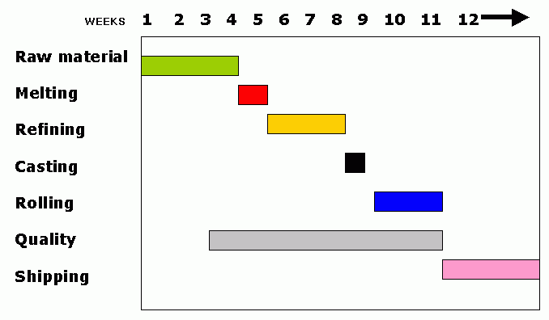

# Algorithms Overview

This section is about what computer programs (or humans with pencil and paper and a lot of work) can do with Valueflows economic networks once they are constructed on the Web or in a database.

## Network-based algorithms

* **Dependent Demand** constructs schedules for operational economic networks from recipes
    * Many other scheduling algorithms can be used over the same recipes. 
    * [Gantt charts](https://en.wikipedia.org/wiki/Gantt_chart) are a popular network schedule visualization.
    
    * **Critical Path** is another scheduling algorithm that analyzes a network of processes to figure out the bottlenecks, the processes that need special attention.
* **Value Rollups** summarize the total value of all inputs to the resulting output from a recipe.
* **Value Equations** determine how income should be distributed according to contributions to a deliverable item.
* **Track and Trace** follow the path of a resource forwards (to where it went) and backwards (where it came from, and what other resources went into it).
* **Provenance** is like Trace, focusing on the path of a resource and all of the other resources that went into it.
* **Cash Flow** is mostly about money, but could also apply to other resources, looking at the inflows and outflows on a timeline, historical in the past, forecasted in the future.
* **Economic and Ecosystem Analysis**:

    * [System Dynamics](https://en.wikipedia.org/wiki/System_dynamics)
    * [Systems Ecology](https://en.wikipedia.org/wiki/Systems_ecology) including [Energy Flow Analysis](https://en.wikipedia.org/wiki/Energy_flow_(ecology))
    * [Input-Output Analysis](https://en.wikipedia.org/wiki/Input%E2%80%93output_model)
    * [Environmentally Extended IPO Analysis](https://en.wikipedia.org/wiki/Environmentally_extended_input-output_analysis)
    * [Life Cycle Analysis](http://www.openlca.org/project/graphic-modeling/)
    * [Material Flow Analysis](https://en.wikipedia.org/wiki/Material_flow_analysis)
    
    
* **Network Flows** is a general name for all of those algorithms and many many more. See [Flow Networks](https://en.wikipedia.org/wiki/Flow_network) on Wikipedia and elsewhere.

There are similarities and differences among the algorithms:

* Scheduling algorithms and cash flows use time-phasing: placing planned or reported events on a timeline.
* Dependent Demand schedules backwards from an end date; Critical Path schedules forwards from a start date.
* Dependent Demand does an explosion: breaking down the end resource of a recipe into a tree of components and processes.
* Value Rollups do an implosion: summarizing all the inputs of the exploded tree of components and processes into a total value.
* The Economic and Ecosystem algorithms use [Input-Process-Output Models](https://en.wikipedia.org/wiki/IPO_model)
* All of those algorithms work on flow networks, otherwise known as directed graphs, composed of nodes and links between them.

## Agent-based algorithms

* [Agent-Based Models](https://en.wikipedia.org/wiki/Agent-based_model)

    * [In biology](https://en.wikipedia.org/wiki/Agent-based_model_in_biology)
    * [In economics](https://en.wikipedia.org/wiki/Agent-based_computational_economics)
    * [In sociology](https://en.wikipedia.org/wiki/Computational_sociology), including [Social Network Analysis](https://en.wikipedia.org/wiki/Social_network_analysis)

* [Complex adaptive systems](https://en.wikipedia.org/wiki/Complex_adaptive_system)
