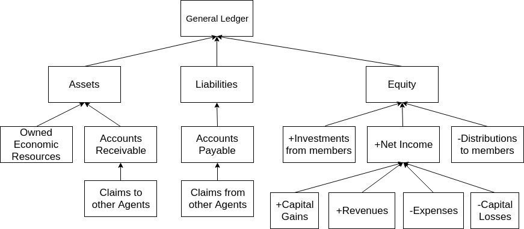

# Accounting

### Recording Basic Economic Activity

The Valueflows vocabulary is based on the REA ontology (Resources, Events and Agents) the ISO Accounting and Economic Ontology, which was evolved for that purpose. (See Appendix for links.)

Since all the data is recorded as the economic activity happens and is represented in its most basic form, you can get separate accounting views for: a network, each group in the network, each project, each individual. In other words, people in the network log events as they occur and the accounting *Just Happens*.

All of the views can emerge from subsets of the same data.  Any standard (or non-standard) accounting report can be created.

Or potentially, views for a global value system economy (really).

### Accounting as in Accountability...

* from peers to each other
* from members to a network
* from a network to the members
* from one network to another
* from a network to the community
* from a network to the ecosystem

Accounting isn't always just counting beans.  It will be important for community economies: what resources do we have, what happened with them, how are they doing? What resources do we need? Who needs what? Who can provide what?  What waste have we generated and how can we improve?

### But if you want to count beans...

The standard set of accounting reports are needed by many organizations. A standard General Ledger, Balance Sheet, and Income Statement can be generated automatically from Valueflows data. No need to create a Chart of Accounts or post double-entries, those can all be created by a computer program on request.

Moreover, General Ledgers and accounting reports can be created automatically for each agent in an economic network using the VF vocabulary.  The accounting views use the Dependent or Individual Agent view of ValueFlows. See also [Independent vs Dependent views](../introduction/core.md#independent-vs-dependent-views).

Accounting statements can also be updated instantly for each participant in any economic event as soon as the event is recorded. For example, consider an economic exchange, where one agent transfers some goods to another, and the other agent transfers some money in return. The inventory of the goods-providing agent will be instantly decremented, and the receiving agent's incremented. Likewise the money accounts of the money-providing and receiving agents will immediately change. Income statements, balance sheets, and cash flow reports can reflect the new changes immediately. The financial positions of each agent can always be up-to-date as of the last recorded event.

This article describes how to generate General Ledgers etc. from REA data using procedural code: [Operation of a Relational Accounting System, Graham Gal and Bill McCarthy](../linked-docs/OperationofaRelationalAccountingSystem.pdf)

Wim Laurier is working on how to do it declaratively. [This paper](../linked-docs/paper8.pdf) gives an early view of how Wim and Satoshi Horiuchi intend to do it.

The difference between doing it procedurally and doing it declaratively:

* A procedural program defines a step-by-step method of getting the desired results.
* A declarative program describes the desired results and hands it to another program that can generate the desired results from your description. The person who desires the results writes much less code.
