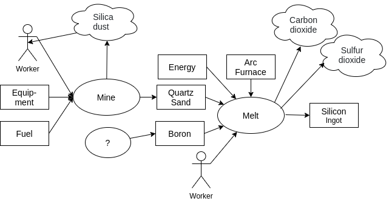

# Ecological Accounting

### Why ecological accounting

There is increasing desire to account for "externalities" from human production and transportation processes, and certainly the need has always been there. There are also more and more efforts to do "climate accounting" on a global level, to provide knowledge in the efforts to improve the situation, which is spiraling out of control on many levels - climate chaos, soil and biodiversity loss, uncontrolled emission of substances on the land and in the water toxic to life, etc. 

There are many reasons this has not been part of the accounting paradigm, including interests of corporate players and tendencies of industrial era humans to think about "the environment" as something separate from us, from which we can extract resources without regard to the many interconnections.  Although there are some efforts to give ecologies rights relative to human impact, and helpful ways to think about the issues from indigenous sources and people working on the "commons", a large "paradigm shift" will be needed and there is much inertia and resistance.

As always, our goal is to give Valueflows the latitude to support both conventional and next economy accounting.  The latter will more and more involve ecological accounting.  So, understanding there will be much more learned going forward in practice, we want to make Valueflows broadly supportive of these efforts.

### REA I-P-O resource flows

The Valueflows input-process-output resource flow model works very well for ecological accounting, with some broadening of our thinking about agents and resources, and what "economic" entails.  If we think of "economic" as broader than human activity, which has tentacles into most if not all of the other ecosystems on earth, it becomes easier to consider "accounting" in light of flows to and from those ecosystems, all of which eventually affect human economies.

This diagram shows some of the flows for solar panel production.  Silica dust is an output of the mining process, which gives mine workers silicosis.  There are many additional flows here which could be detailed to go into and out of ecological ecosystems, affecting them and also humans.

### Economic Resources

We have thought of economic resources as having use value (and possibly exchange value) to humans and ecosystems.  If we broaden that to include "bad" as well as "good" resources, we can model more completely and accurately the resource flows that impact ecosystems including humans.  It is also not very helpful to even think in terms of "bad" and "good", since that is conditional.  For example, CO2 is "good" for plants in a greenhouse, but "bad" pumped into the atmosphere, and some of the CO2 in the greenhouse will leak out, making it "bad"... yet it is the same substance.

### Agents

We have defined Agents as people and organizations (formal or informal).  If we go beyond human-centric thinking, we could conceive of Agents as other living things, and also as groups of other living things, or whole ecosystems.  Those ecosystems could be of any size or complexity, and all of these agents could have various relationships between them.

This requires some things which are traditionally considered to be resources from a human perspective, to be considered agents in their own right.

But how can these non-human agents give input to human accounting systems?  One way is through sensors; another is through human "representatives".  Of course, this is all still unavoidably human-centric.  Some ecological agents need human agents to represent them in human governance activities, similar to specific humans representing organizations. This idea has both supporters and opposition: https://aldf.org/article/federal-judge-strikes-down-lake-erie-bill-of-rights/. But in general, this can be a step forward in being able to broaden our ability to the accounting we need to do.
