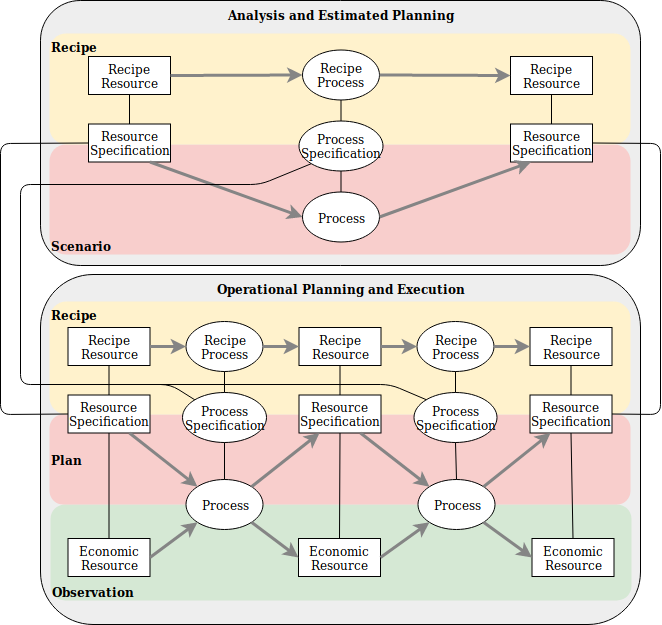

## Scenarios

The Processes section explains processes at their basic level, starting with operational observable processes. The Operational Planning section explains how to group those processes into a scheduled plan at an operational level. This section explains how to use the same process and plan pattern to represent higher level requirements, those that are not (yet) actually scheduled.  We are calling those Scenarios.

Processes can be composed into scenarios at any level.  Like scheduled plans, these scenarios can be created from recipes.  Like scheduled plans, they have inputs and outputs (usually intents, sometimes sumarized economic events), derived from nested processes.

Some examples we have seen:

* <b>Plan Refinement</b>. Before the final operation plan is set, sometimes it is useful to make more general plans, which then can be refined further, ending with the scheduled plan.  These plans are estimates made using "planning horizons", which are defined durations starting from the planning date - for example year then month, then blending into the actual scheduled plans.
* <b>Budgeting</b>.  A Budget is a summary of input requirements for a scope for a time interval (sometimes corresponding to the organization's "accounting period"), often yearly, as a higher level of planning. Budgets are often created to support a specific goal. Budgets are usually created before operational planning is done, and are estimates.  Often a forecast is made consisting of desired or expected deliverables for the period, sometimes using past event history as a starting point.  This would create a demand-driven budget.  Or sometimes a supply-driven budget makes more sense, for example when all of the producing capacity will be used in any case, and then the outputs will be constrained by the inputs available.  In any case, the budgeted inputs and outputs are kept, as they are often compared to actuals later.  The budget itself could be represented as a Process, and it could nest line item processes based on type of resource or process.  A budget is usually for one scope.
* <b>Comparative Analysis</b>.  Often different plans will be created for the same basic data set.  One example is when doing risk analysis or other comparative analysis.  Different assumptions might skew a plan in different useful directions, for example a "normal scenario" and a "worst case scenario".
* <b>Network Analysis</b>.  This is an analytical look at all or some of the actual and/or potential resource flows for a scope, often a community or region.  This can be modeled using higher level types of processes and types of resources, and could include intents or economic events.  One use of this kind of analysis is to identify gaps and opportunities to keep resources circulating in a community to improve economic health and resilience.

Agents can define different scenarios that they want to use. So for example, if a group does yearly budgets, each budget for different years could reference the same "yearly budget" scenario definition.

The model itself is quite flexible, and we expect there will be more uses for it, all using the basic input-process-output structure with resource flows connecting them, contained by a scenario.

## Connecting Plans and Scenarios

Plans do not need to be directly connected to Scenarios, although they can be. If comparisons are needed, often the time periods and scope are all that is needed.  In addition, if resource specifications and/or process specifications are part of a classification taxonomy, that can be used for connecting the higher to lower perspectives.  For example, the plan for carrots could be aggregated into the higher level plan for all vegetables.

Often Plans do not fit cleanly within Scenarios, because plans tend to be for real production when it happens, which usually does not fit nicely into accounting periods or planning horizons.  Seasonal food production can be an exception to this.

Scenarios can be refinements of other scenarios.  For example, a group might do scenarios for yearly estimates, then refine those for each month, before creating operational plans which will be executed.

If other requirements arise, we are happy to add connections as needed to the vocabulary.

