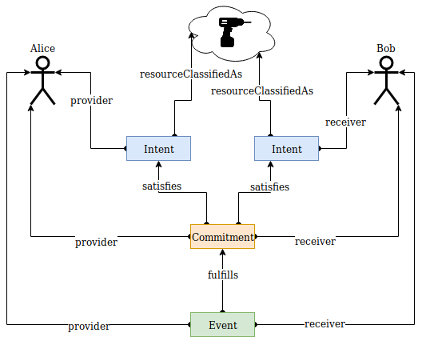
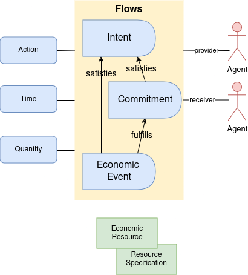

## Kinds of Flows

Flows are a fundamental construct in the Valueflows ontology. The types of flows form a progression from potential to scheduled to realized:

1. Intents which can lead to Commitments
2. Commitments which can lead to Economic Events (or Intents can lead directly to Economic Events)

### Intent

Intents describe potential future events which have not been agreed to by other agents, such as offers and requests. Intents are often used for discovering another agent to participate in a desired event. On the process side, for example, planned work could be an Intent, but planned work that some agent committed to is a Commitment.

### Commitment

Commitments describe potential future events which the involved agents have already agreed to pursue. Commitments can be considered contractual promises from one agent to another.  Commitments can be thought of as plans for Economic Events, and Economic Events can fulfill Commitments.  Commitments can satisfy Intents. 

### Economic Event

Economic Events describe past events, something observed, never some potential future event.  They can fulfill Commitments or satisfy Intents (when there is no Commitment).

### Claim

Claims resemble Commitments, but are initiated by the receiver, not the provider.  An Economic Event can trigger a reciprocal Claim.  Claims sometimes do not have to actually be saved, often they can be implied from an Economic Event and an Agreement.  For example, if Alice has agreed to sell Bob some carrots for $2, then if Alice delivers the carrots to Bob, she has an implicit claim for $2 from Bob.

### Recipe Flow

[Recipes](recipes.md) are used to create plans, and the Recipe Flow can create a corresponding Intent or a Commitment in a Plan, depending on if all the agents are known and the level of certainty of the planning.

## Timeline, plans and observations

The figure below shows that Economic Events have to be observed and for that reason only appear as records of the past. Future plans get represented with Intents and Commitments.

## Matching Intents

Often agents will start their plans independently and record their initial intents. Later once they make a Commitment with another agent, it will represent a specific shared part of their plans. For that reason any Commitment can result in Satisfaction of the providing agent's Intent as well as Satisfaction of the receiving agent's Intent.

## Granularity

Intents, Commitments, and Economic Events can occur at any granularity that is needed or for which data can be obtained.  So they primarily are used for all operational needs, but can also be used at higher levels for budgeting for organizations, analytical and high level planning needs for communities or regions, etc.

## Actions

All types of flows use the same set of actions, which define what the flow does and how it behaves in relation to resources.  You can find detailed documentation on actions [in the Actions section](actions.md).

## Quantities and Times

Quantities are used for counting, such as:

* Exchange/transfer
* Resource increment and decrement
* Recipes, how much or many goes into and out of a transformation process

Times are used for coordination and scheduling, such as:

* Calendar availability
* Planned timelines

They can be used together for analysis and reporting, such as:

* Accounting totals (quantity) within accounting period (time)

Quantities can be any needed unit of measure, including counts, volumes, weights, etc.  Time can be a beginning/end time (an interval), or a point in time, or a due date.  The flows require at least one of those.  If a point in time is recorded, an application should return that time as the beginning and end time.

Note that recipes may need to scale both quantities and calendar times when used to create a plan.

Sometimes a quantity is expressed in time-based units, like "I worked 6 hours", or "we used this machine for 8 hours".  These flows also will have a related time, like "I worked from 10am to 4pm", or "we used this machine from 8am to 4pm". In these examples, the quantity is used for accounting figures, exchange, recipes.  The time is used to schedule and coordinate the work or machine usage.

Sometimes a situation may call for a "compound quantity", like "Number-per-Year".

See also [the Units page](../specification/units.md).

## Correcting Events

Economic events are immutable in accounting practice, since at any time they could have been reported formally.  Do correct an economic event, you need another economic event, which can be related to the first one with the relationship `corrects`.  The correcting event can have a negative number.  It can either completely back out the original event or adjust it.
