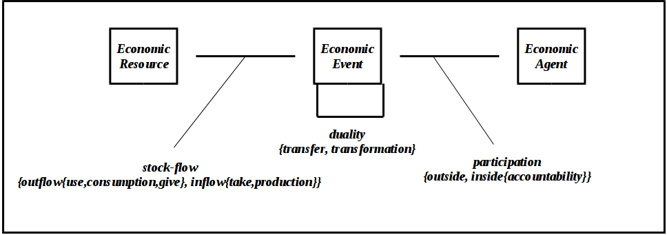
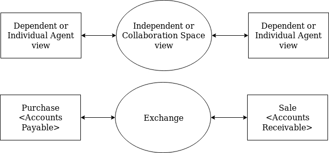
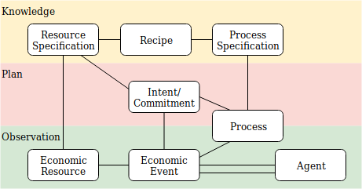

# Core

### REA (Resource, Event, Agent)

The vocabulary has a core that would fit many different kinds of economic formations  - value networks, supply chains, joint ventures, business collaboration network, distributed cooperatives, multi-stakeholder cooperatives.... as well as more traditional enterprises.

The core is based on the REA (Resource, Event, Agent) ontology. You can find all the details by following the [links here](../appendix/rea.md).

These are the main concepts in the REA ontology, as pictured in this [document](../linked-docs/The+Ontological+Foundations+of+REA+Enterprise+Information+Systems_2000.pdf):

Economic events are the movers and shakers.  They say what is happening to economic resources, and what economic agents are involved along the way.  They create the "value flows".

A key concept in REA is Duality, which means that each event wants one or more balancing events: in other words, some kind of reciprocity.  REA uses an abstract word for this relationship in order to make the meaning configurable. The reciprocity does not need to happen at the same time, or in the same transaction.  And it can have any logic that a network wants: payment in money, swap, earn credits, earn reputation points, share with the commons, from each according to ability and to each according to need, etc.

### Independent vs Dependent views

Conventional accounting always takes the view of an individual agent: often a company. REA, and Valueflows, take an independent view, sometimes called a “collaboration space” or economic network or supply chain view.  At the same time, derived from the independent view, REA and Valueflows support each agent's own accounting view.

For example, from one agent's viewpoint, the exchange may be a "purchase", from the other agent's viewpoint, it might be a "sale". From the neutral viewpoint, it is an exchange of resources, with usually at least two flows of resources, from different directions.

For the individual agent’s accounting systems, assuming an Exchange of goods for money, when the goods are transferred from the seller to the purchaser, the purchaser’s Accounts Payable are increased (credited) and the seller’s Accounts Receivable are increased (debited). The independent view sees a transfer of goods from one agent to another.

While conventional accounting uses the individual agent view, larger-scale economic analyses and planning, like for networks, communities, and bioregions, use the independent view. See [Value Flow Algorithms](../algorithms/overview.md).

### Levels of the ontology

All the levels of the REA ontology are similarly flexible and configurable:

* The Knowledge level represents classification, policies, procedures, rules and patterns. This is where each network or community can configure the core concepts to fit their desires.
* The Plan level represents offers, requests, schedules and promises.
* The Observation level represents what really happened.

The core Valueflows vocabulary includes some concepts for which we use other rdf-based vocabularies. There may also be terms that applications will need that are not part of the Valueflows economic model. This means that it expects people developing those applications to use VF together with other vocabularies / web ontologies. This documentation will define other vocabularies and specific terms from them that will be needed in common scenarios that VF aims to address.
