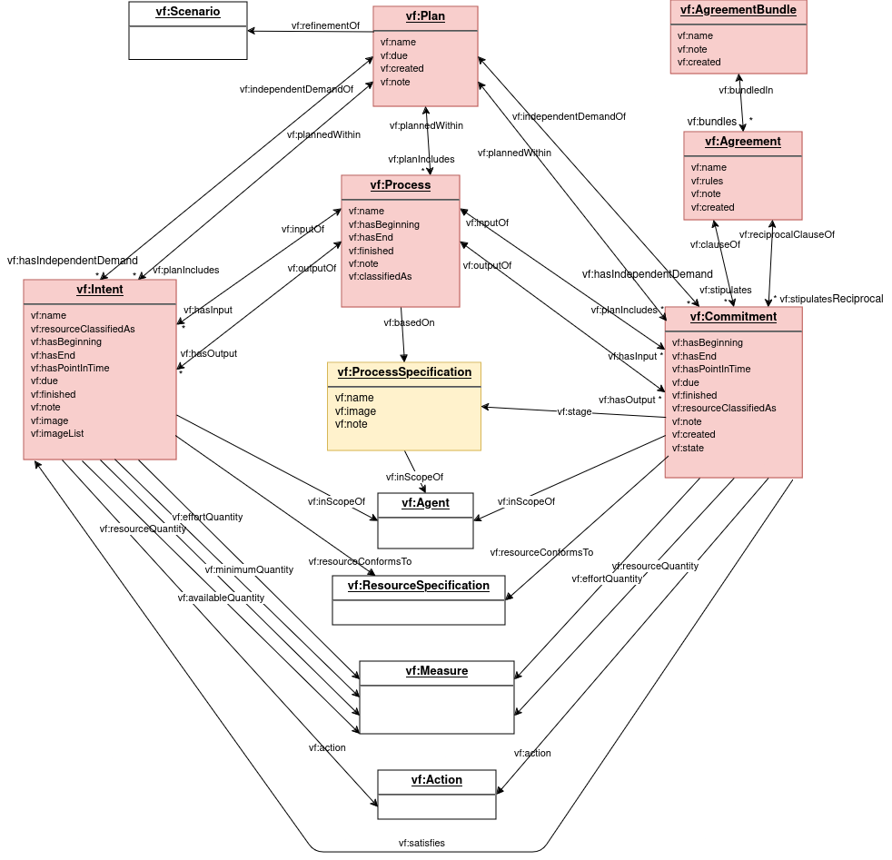
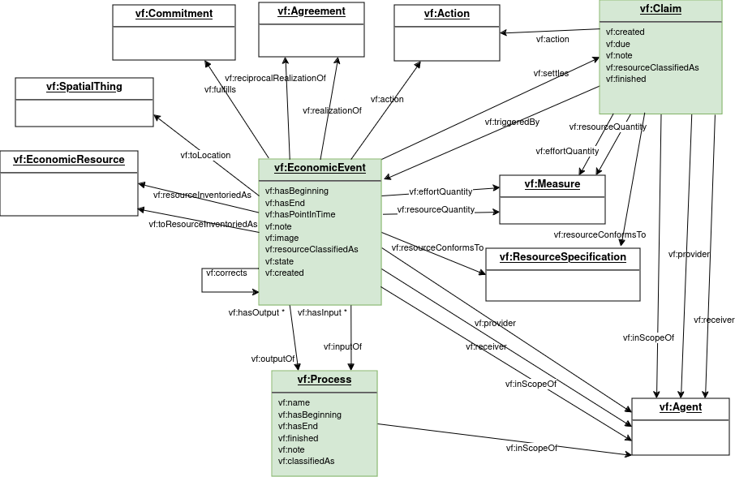
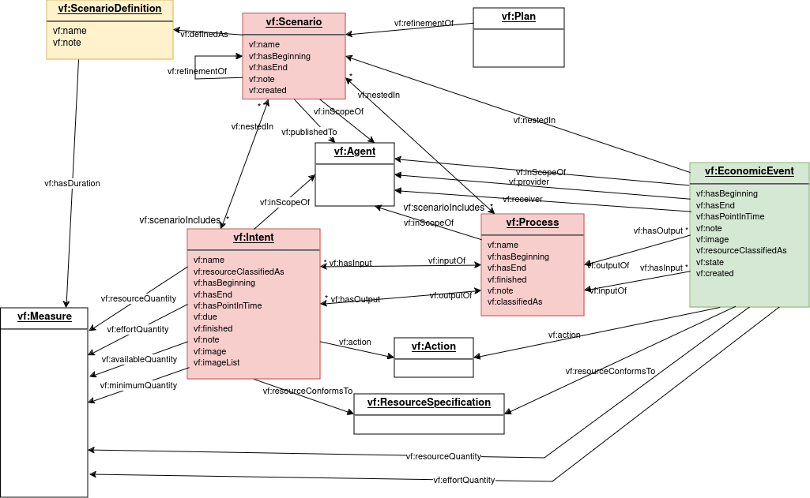

# Diagram Explanations

These textual explanations are a break-down of the UML diagram on the previous page.  The explanations are organized by class within subject area of the model.

### Agent

The Agent subject area defines roles in the Knowledge Layer and defines agents and their relationships in the Observation Layer.  More info at [Agent concepts](../concepts/agents.md) and [Ecological Agents](../concepts/ecology.md#agents).

#### vf:Agent

The Valueflows view of Agent is fairly broad, including people, organizations (formal or informal), and ecological agents such as non-human beings and ecosystems.  But all of these have economic or governance agency of some sort.

Agents are key to the overall ontology, particularly the flows in Planning and Observation: Intents, Commitments, EconomicEvents, Claims, where each can reference a provider and receiver Agent. Proposals can be published to Agent(s), and Agents can have many AgentRelationships with other Agents of any type.

There are 3 subclasses of Agent: **vf:Person**, **vf:Organization**, and **vf:EcologicalAgent**.

#### vf:AgentRelationship

The subject and object of an AgentRelationship are Agents.  Their role the subject plays in relation to the object is represented by the AgentRelationshipRole.  Agents can have multiple relationships and multiple kinds of relationships in the same network.

#### vf:AgentRelationshipRole

Agent relationship roles define the roles or types of agent relationships within a network, completely defined by the network itself.  Roles can be a good base to define user account permissions.

### Resource

Resources are defined in different ways, depending on their need and ability to be accounted for specifically.  Every flow of any kind will reference a resource, represented either by ResourceSpecification or EconomicResource. Resource classifications also assist in understanding or finding a resource. More info at [Resource concepts](../concepts/resources.md), [Classification concepts](../concepts/classification.md).

#### vf:ResourceSpecification

This specifies the kind of resource, to the most specific level needed.  It also fills the space for the resource when it is not yet, or never will be, an actual resource.  It can be used in and across networks to communicate the resource type needed.  EconomicResource, as well as the resource concept referenced in flows (EconomicEvent, Intent, Commitment, Claim, RecipeFlow), conform to a ResourceSpecification.

#### vf:EconomicResource

An actual EconomicResource is created only by EconomicEvents.  It is also updated only by EconomicEvents for all its accounting related properties.  It becomes involved in a Process by being referenced by an EconomicEvent. It can appear on a Commitment or Intent if recording of a specific resource is needed.  It must have a ResourceSpecification.  It can have a stage and/or a state.  It knows its primary accountable Agent at any point in time.  It can be contained in another EconomicResource.

### Putting flows into motion...

More flow info at [Flows concepts](../concepts/flows.md), [Actions concepts](../concepts/actions.md), [Processes concepts](../concepts/processes.md), [Transfers concepts](../concepts/transfers.md), [Exchanges concepts](../concepts/exchanges.md).  First, some necessary pieces.

#### vf:Action

An Action specifies the type of flow and what the flow will do or has done. EconomicEvent, Commitment, Intent, Claim, RecipeFlow have an Action.  Actions are specified in Valueflows to cover the various ways flows affect resources.  Actions have properties defined that can drive the code logic to create or change EconomicResources when EconomicEvents are recorded, if desired.

#### vf:SpatialThing

Physical location, represented by SpatialThing, is mostly used as part of the information about agents, resources, and flows, although it can stand on its own if needed. It is primarily used for mapping. Although the relationships are not shown in the above diagram, the following are a SpatialThing: in EconomicResource, currentLocation; in Agent, primaryLocation; in EconomicEvent, Commitment, Intent, atLocation; and in EconomicEvent, toLocation.  When something has a non-physical location, it will use a different property. More info at [Use of Other Vocabularies](/specification/external-terms/#locations).

#### vf:Measure

Measure does not ever live on its own, it is a way to unify how quantities are represented in Valueflows.  Although the relationships are not shown in the diagram, the following are Measures: in EconomicResource, accountingQuantity and onhandQuantity; in EconomicEvent, Commitment, Intent, RecipeFlow, resourceQuantity, effortQuantity.  Measure is a numerical value plus a Unit. More info at [Use of Other Vocabularies](/specification/external-terms/#quantities-and-units).

#### vf:Unit

It is very helpful for interoperaability that the same units of measure are used as networks communicate.  VF uses units defined by OM2, with some additional properties. More info at [Use of Other Vocabularies](/specification/external-terms/#units-of-measure).

### Flows in motion: Recipe

This set of Knowledge Layer entities together make a recipe for creating a Resource conforming to a ResourceSpecification. It can be used to automate generating a plan in the Plan Layer, since they follow the same basic input-process-output graph pattern. The recipe model may be made more complete in the future, to support forking, versioning, and variants.  It currently supports multiple recipes for the same ResourceSpecification.  It also supports a Recipe for more than one RecipeProcess in a flow graph, and RecipeGroup for creating a plan that includes more than one output from different Recipes.  More info at [Recipes concepts](../concepts/recipes.md).

#### vf:RecipeProcess

This defines a process node in the recipe graph.  A recipe can contain as many RecipeProcesses as it needs to produce the resource defined in the final ResourceSpecification. It can optionally conform to a ProcessSpecification.  It will have at least one input or output RecipeFlow.

#### vf:RecipeExchange

RecipeExchange corresponds to the Agreement in the Plan Layer.  It enables generation of plans that include agreements.  It can contain as many RecipeFlows as needed.

#### vf:RecipeFlow

A RecipeFlow defines either an input or output to a RecipeProcess, and/or a clause of a RecipeExchange.  RecipeProcesses and RecipeExchanges can be combined into one recipe if desired.  A RecipeFlow through its Action defines how it will affect the (resource of the) ResourceSpecification.  If it defines a ProcessSpecification stage, then the flow expects a resource at that stage of production.

#### vf:Recipe

A Recipe defines a way to easily tie all the RecipeProcesses needed to create an output.  If your Recipes have only one RecipeProcess, you may not need Recipe.

#### vf:RecipeGroup

A RecipeGroup makes it easy to include more than one output from more than Recipe in one Plan.

### Flows in motion: Planning

Planning can be done with or without recipes.  And planning is not always done, sometimes the economic activity is only observed, depending on the use case.  This section is about operational planning, proesses and agreements that are intended to be executed in this lowest level of detail.  More info at [Planning concepts](../concepts/plan.md) and [Generation of Plans](../../concepts/recipes#generation-of-plans).

#### vf:Plan

A Plan is a collection of one or more operational Processes and/or non-process Commitments (such as transfers) in the input-output-process graph pattern.  Plans can also reference one or more Commitments that create the independent demand that provides the reason for, and final output of, the Plan. If the use case calls for it, Plans can be nested in Scenarios to give higher level views that drill down to operational Plans, or reference a Scenario that was done as a pre-planning effort.

#### vf:Process

This section talks about operational processes, see below for higher level processes.  A Process can exist both in the Plan and Observation Layers, or either one.  If it is planned, then observed as an actual process, it remains the same Process.  So it can have input and/or output Commitments, and/or input and/or output EconomicEvents.  It can also have input or output Intents, if all or some of its flows are not committed, but are intended to happen.  Processes are usually (but not required to be) planned within a Plan.  A Process can be based on a ProcessSpecification or not.

#### vf:ProcessSpecification

This specifies the kind of Process, to the most specific level needed.  Processes can be based on a ProcessSpecification.  It is also used as the stage of an EconomicResource that is created in stages, and is part of the logical identifier in those cases.  RecipeFlow and Commitment can have a ProcessSpecification stage specified to indicate that the resource they expect is at a particular stage, for example "tested" or "edited".

#### vf:Commitment

A Commitment is a planned flow.  It can be input or output of an operational Process or planned directly in a Plan if it is a non-process flow. It also can be defined as an independent demand of a Plan, meaning it is creating what the plan is for.  It can be a clause of an Agreement, even if also an input or output of a Process.  It references something to define a current or future resource, often a ResourceSpecification, but sometimes an existing EconomicResource if that exists and is important, usually because it is one-of-a-kind. Like all flows, it references an Action that defines its effects on the resource.  It can satisfy one or more Intents or be fulfilled by one or more EconomicEvents.  A Commitment references both a provider Agent and a receiver Agent, although it can be planned temporarily without both provider and receiver if there is a committed Agent assumed or immediately expected as part of planning. If it defines a ProcessSpecification stage, then the flow expects a resource at that stage of production.

#### vf:Agreement

An Agreement is a purposefully abstract term, so that it can represent many existing (or not-yet-invented) kinds of agreements, e.g. exchanges or income distributions.  Its main purpose is to contain related Commitments in planning, usually reciprocal commitments.  It can also be used to contain reciprocal EconomicEvents in cases where there has been no planning, such as point of sale.

#### vf:AgreementBundle

An AgreementBundle contains all the agreements bundled together for user purposes, for example multiple line items in an order.

#### vf:Intent

Intent is defined here as part of operational planning, but can also be key as part of a Proposal or part of a Scenario, see below for those uses of Intent.  An Intent has a provider or a receiver Agent, but not both. As part of planning, Intents can be entered directly or generated from recipe, as inputs or outputs to a Process, or as non-process flows, when there is no known Agent assumed to be the missing provider or receiver.  An Intent can be satisfied by one or more Commitments, and/or one or more EconomicEvents if the Commitment does not exist.  And as a flow, an Intent will have an Action. In operational planning, it will also reference a ResourceSpecification or EconomicResource.

### Flows in motion: Offers and Requests

Offers and requests are published primarily to look for a reciprocal match, although they can also be gift offers or requests. Common use cases are e-commerce, timebanks, mutual aid, price lists, publication of help needed for planned work in a network.  More info at [Proposals concepts](../concepts/proposals.md).

#### vf:Proposal

A Proposal is a container of related Intents, and is an offer or a request, determined by the purpose.  This also corresponds to whether the provider or receiver Agent is undefined in the primary published Intent. Proposals often have more than one Intent, either because there is a reciprocal Intent, or because more than one resource is being offered or requested together.  An Intent can be re-used in more than one Proposal.  A Proposal can be proposed to one or more specific individual or group Agents, or just be part of a scope where Proposals are published.

#### vf:ProposalList

A ProposalList contains all the proposals in a user-defined grouping, for example a price list.

#### vf:Intent

Intents that are part of Proposals can be more loosely defined than if they are part of a Plan, although planned Intents can also be part of one or more Proposals.  For example, the note is often used to explain some of the defined fields when the offers/needs application mostly supports just text.  But all Intents should have an Action, and either a provider or receiver Agent.

### Flows in motion: Observation

The Observation subject area is where economic activity actually happens.  The basic input-process-output graph pattern is again the same as for recipes and planning. More info at [Flows concepts](../concepts/flows.md).

#### vf:Process

See the operational Process defined in the Planning subject area.  Operational Processes are carried down to the Observation layer as they are executed, or can be directly defined for Observation if planning is not done.

#### vf:EconomicEvent

An EconomicEvent is the "real" flow, one that actually happened.  Its behavior is governed by its [Action](../concepts/actions.md).  It actually affects an EconomicResource if one is defined as inventoried and referenced in the EconomicEvent, possibly including quantities, location, primary accountable, stage, state, containment.  EconomicEvent has a provider and receiver Agent, and can be input or output of a Process, and/or part of an Agreement.  An EconomicEvent knows its resource, either an EconomicResource or a ResourceSpecification.  In some actions, for example transfers and moves, there can also be another EconomicResource on the receiver side.  EconomicEvents can fulfill a Commitment or satisfy an Intent (where there is no Commitment) or settle a Claim.  An EconomicEvent can correct a previous EconomicEvent, or reverse it completely.

#### vf:Claim

A Claim on another Agent is triggered by an EconomicEvent, according to rules agreed to elsewhere, although most EconomicEvents do not trigger a Claim, and if there is already a Commitment, a Claim is not needed.  The Claim then can be settled by other EconomicEvent(s).  As a flow, a Claim has an Action, provider and receiver Agent, and reference to a ResourceSpecification.

### Analysis, Pre-planning, Aggregation

More info at [Budgeting and Analysis concepts](../concepts/estimates.md).

#### vf:Scenario

A Scenario is used as a grouping mechanism for flows.  It is a loose concept, and can support many situations.  It can be defined by a ScenarioDefinition.  It can contain Plans, Processes, Intents, aggregated EconomicEvents.  A Scenario can also be nested in itself, to support continued zooming out to less detail.  The uses below are some but probably not all of the possibilities.

#### vf:Plan

When Plans (which are operational) are nested in a Scenario, the Scenario can be used to zoom out for less detail in a UX.  When a Plan is a refinement of a Scenario, the Scenario was an earlier estimate or pre-plan.

#### vf:Process, vf:Intent, vf:EconomicEvent

When Processes are nested in a Scenario, they are generally higher level processes for aggregated as-is or to-be resource flows, for analysis or persuasion. Non-process Intents or EconomicEvents could also be part of these Process higher level flows.

Processes and/or Intents could also be nested when they are part of a budget, forecast, or other higher level pre-plan. Or with-list Intents might be listed, say for large many-agent barter, or when saved for future Proposals.
