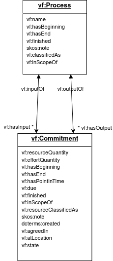
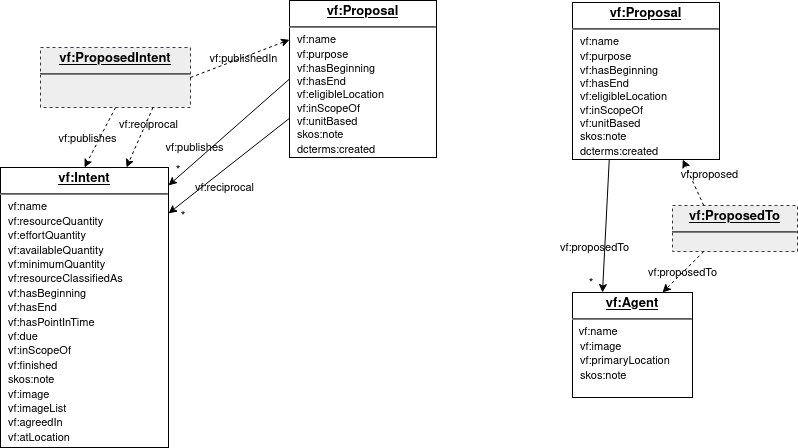

## UML diagram

This diagram includes all elements necessary for a complete REA-based core economic vocabulary, so includes elements that we re-use from other vocabularies.  All namespaces are documented by the prefix to each element.

A textual explanation of everything on this diagram is on the [next page](model-text.md).

*To make the diagram bigger, you can right click and select 'View Image' or 'Open Image in New Tab' or a similar command in your browser.*

## Diagram conventions

The diagram basically supports relational data models.  The arrows point towards a single instance of the class at the end of the arrow, like relational foreign keys.  So each arrow represents an additional property in the class at the beginning of the arrow.

### Relationships not shown

In some cases, there were just too many lines!  The subordinate classes in the gray section at the bottom are not connected with arrows, so the viewer should assume that every property ending in "Quantity" is a `om2:Measure`; every property ending in "Duration" is a `time:Duration`, and every property ending in "Location" is a `geo:SpatialThing`.

Also, `vf:inScopeOf` points to a `vf:Agent`.

### Inverse terms

To support cleaner representation in JSON-LD / RDF, as well as object oriented collections, we included some inverse terms, using `owl:inverseOf` in the source turtle file.  These are noted with a * (meaning "many") at the "other" end of a relationship.  For example, here a Process or a Commitment can be `plannedWithin` a Plan; and a Plan `planIncludes` either or both Processes and Commitments.

### Many-to-many relationships

Instead of the typical relational resolution of a many-to-many relationship of including an "associative" class or table between them, we are specifying a direct one-to-many relationship, which more cleanly supports JSON-LD / RDF / OO structures.  To get to the other less-used "many", in this case an Intent can be `publishedIn` many Proposals, a query would be needed.

Although not included in the formal RDF-based spec, the intermediate class is also shown with dotted lines, for projects who want a relational database representation.  In this case, a Proposal `publishes` a primary Intent or a `reciprocal` Intent.  The "many" is accomplished with many ProposedIntent records.

