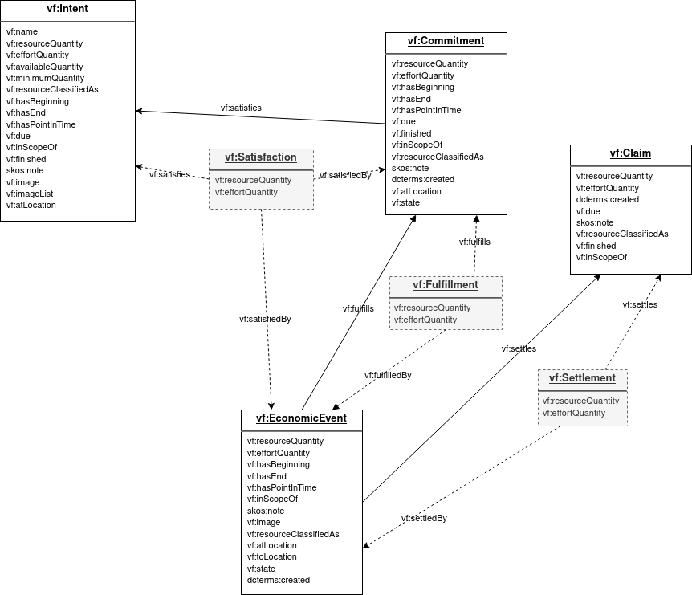

## UML diagram

This diagram includes all elements defined in the system of record turtle file, for visual understanding of relationships.

A textual explanation of everything on this diagram is on the [Diagram Explanations page](model-text.md).

*To make the diagram bigger, you can right click and select 'View Image' or 'Open Image in New Tab' or a similar command in your browser.*

## Diagram conventions

Each arrow represents an additional property in the class at the beginning of the arrow.  If there is an * at the arrowhead end, then many instances are supported (like a collection in object oriented modeling).  If there is no *, then it should be assumed that one instance is supported (like a foreign key in a relational model).

### Relationships not shown

In some cases, there were just too many lines!  The subordinate classes in the gray section at the bottom are not connected with arrows, so the viewer should assume that:

* every property ending in "Quantity" or "Duration" is a `vf:Measure` (does not live on its own) ;
* properties ending in "Location" that are physical locations are a `vf:SpatialThing` ;
* `vf:inScopeOf` references a `vf:Agent`.

### Inverse terms

To support cleaner representation in JSON / JSON-LD / RDF, as well as object oriented collections, in addition to the initial relational representation, we include some inverse terms, using `owl:inverseOf` in the source turtle file.  If there is a name on each end of the line, and an end on both sides of the arrow, there is an inverse defined.

For example, here a Commitment `isInput` or `isOutput` of a Process; and a Process `hasInput`(zero or more) and/or `hasOutput`(zero or more).  Both directions are specified as part of the formal vocabulary, so can be used in the direction preferred by the application.

The first several examples on [the Examples-Production page](../examples/ex-production.md) show both options as yaml.

### Many-to-many relationships

Instead of the typical relational resolution of a many-to-many relationship of including an "associative" class or table between them, we are specifying a direct one-to-many relationship, which more cleanly supports JSON / JSON-LD / RDF / OO structures.  To get to the other less-used "many" without the "associative" entity, a query would be needed.  The suggested query names are included in [Query Naming](inverses.md).

Below are the places in Valueflows where there is a logical many-to-many.

#### published, proposedTo

Although not included in the formal RDF-based spec, the suggested intermediate "associative" class for the two cases where there are no intermediate properties is shown below with dotted lines, for projects that want to implement a relational database under the covers, for example.

#### fulfills, satisfies, settles

These cases have possible properties in the "associative" class. For example, between Commitment and EconomicEvent, a Commitment for 40 hours of work might be fulfilled by 5 EconomicEvents of 8 hours.  Or an EconomicEvent might pay for a statement or invoice that includes multiple Commitments for deliveries.  The model we have settled on supports the former, but not the latter.  The latter is one of a few cases that we believe will be a small minority of edge cases where the quantities in the "associative" entity might be appreciated.  For that case, an application could possibly divide the payment into multiple EconomicEvents and connect them with the trackingIdentifier.  Or it could extend the vocabulary to include the quantity fulfilled/satisfied/settled, and over time the VF community can re-consider the best trade-off for handling this situation.

We believe that it is more important to simplify the model and the concepts for the majority of use cases, than to have complete support of all use cases.

### Denormalization

Note there are a few place where VF is more normalized than might be wanted for a database design behind the scenes. However, for data provided for interoperability, it is expected that apps will adhere to the normalized version.

For example, we have used a separate structure for quantities, including the numeric amount and unit of measure.  These never stand on their own, i.e. one wouldn't expect to change "4 liters" in an event and have it change wherever else "4 liters" appears.  So these can be safely denormalized behind the scenes.

This also could apply to simple uses of location data, although in that case, locations can stand on their own, so it depends on the application.  But for example, some apps might move `SpatialThing`'s `long` and `lat` into the record having the location.
